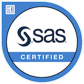
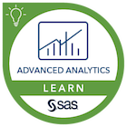
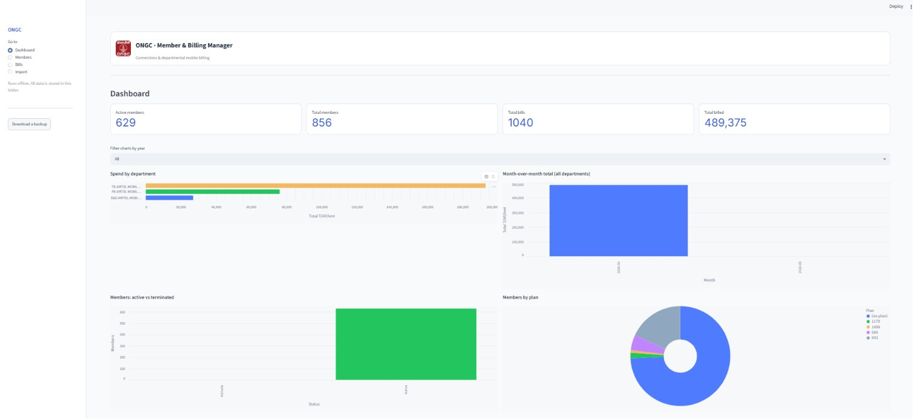

# Hi there, I'm [Siddhant]! 👋

## About Me 🚀

I'm a passionate **[Business/Data Analyst]** with experience in **[Python,SQL,Power BI]**. I enjoy transforming raw data into actionable insights and building practical applications that solve real-world business problems.

- 🌱 Currently learning: **[Advanced Dax And Advanced Power BI Analytiics]**
- 🔭 Working on: **[ONGC Member Billing Application]**
- 🌍 Languages: **[Python(programming) and English(communication) ]**
- 📫 How to reach me: **[siddhant.datalab@gmail.com]**
- ⚡ F-act!: **[stop starting start finishing]**

## My Skills 🧠

## Featured Projects 💻

### You can check out the repository here:
[ONGC Member Billing Application](https://github.com/siddhantdatalab-maker/your-repository-name)

**[ONGC Member billing Application]** is a **[billing desktop application]** built with **[Python,SQlite and streamlt]**. This project demonstrates my ability to **[Database design and management,Application development,Business Process Automation,Data Handling & Reporting]**. You can check out the repository here:
[ONGC Billing Manager](https://github.com/siddhantdatalab-maker/ongc-billing-manager)

## Get in Touch 📬

- **[LinkedIn](http://www.linkedin.com/in/siddhant-singh-792866194)
- **[Email](mailto:siddhant.datalab@gmail.com)

